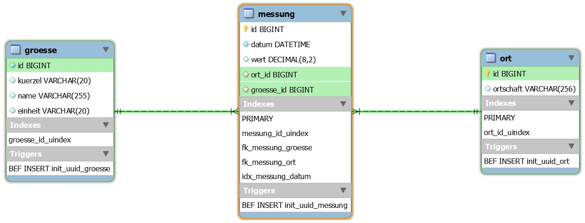
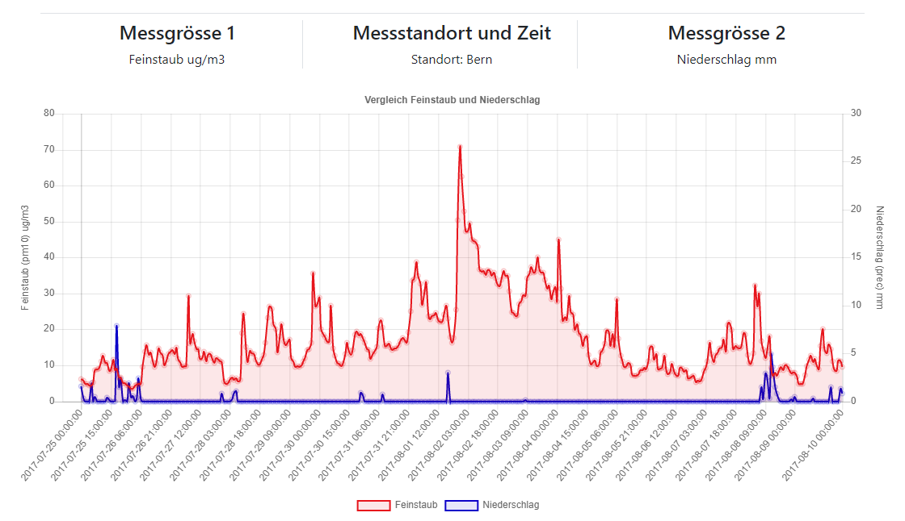

# DBS FS 20 – Gruppe 3
Grüter Julien, Heller Joshua, Hostettler Maurizio, Stofer Stephan
  


## Use Case

- Verschmutzen Feuerwerke unsere Luft messbar?
																	   


## Datenquelle
Messnetz des «Nationales Beobachtungsnetz für Luftfremdstoffe» kurz **NABEL**.

- **16 Messstationen** in der Schweiz
- **13 Luftfremdstoffe** inkl. Temperatur und Niederschlag
-  Daten **seit 2000** im Stundentakt aufgezeichnet

Verfügbar auf : [https://bafu.meteotest.ch/nabel/index.php/abfrage/start/german](https://bafu.meteotest.ch/nabel/index.php/abfrage/start/german)
Die Daten können als Grafik, HTML-Tabellen oder CSV-Datei heruntergeladen werden.
```
Station: Jungfraujoch
Hochgebirge
Stundenmittelwerte, PREC: Stundensummen
MEZ/CET
Quelle: NABEL/MeteoSchweiz
Datum/Zeit;O3 [ug/m3]
01.01.2000 01:00;63.8
01.01.2000 02:00;64.9;
01.01.2000 03:00;65.3;
...
...
```

## Konzeptionelles Datenmodel
### Datenbanktechnologie
Weil wir mit statischen Messdaten arbeiten, haben wir uns für eine SQL-Technologie entschieden.
Dazu haben wir im Enterprise-Lab eine VM angefordert und einen MySQL-Server 8.0 installiert.
### Entity-Relationship-Modell
Auf Basis der Datenanalyse haben wir folgendes Relationenmodell entworfen.  

## Konfiguration Datenbank
Mit wenigen SQL-Statements konnten wir die Datenbank für unser Vorhaben vorbereiten.
### Datenbank und User
```sql
CREATE DATABASE dbs;
```
```sql
CREATE USER 'php_user'@'%' IDENTIFIED BY '******'; 
```
```sql
GRANT SELECT, CREATE TEMPORARY TABLES ON dbs.* TO 'php_user'@'%'; 
```
### Tables
Als Referenz zur Erstellung der Tables das SQL-Statement der Tabelle «Grösse».
```sql
create table groesse
(
    id      bigint(20)   not null,
    kuerzel varchar(20)  null,
    name    varchar(255) null,
    einheit varchar(20)  null,
    constraint groesse_id_uindex
        unique (id)
);

alter table groesse
    add primary key (id);
```
#### Trigger
Für die Generierung der ID definieren wir einen Trigger.
```sql
create definer = sa_dbs@`%` trigger init_uuid_groesse
    before insert
    on groesse
    for each row
    SET NEW.id = UUID_short();
```
## Physisches Datenbankschema
Das physische Datenbankschema präsentiert sich wie folgt:  


## Datenimport

Noch bekannt? 
```
Station: Jungfraujoch
Hochgebirge
Stundenmittelwerte, PREC: Stundensummen
MEZ/CET
Quelle: NABEL/MeteoSchweiz
Datum/Zeit;O3 [ug/m3]
01.01.2000 01:00;63.8
01.01.2000 02:00;64.9;
01.01.2000 03:00;65.3;
...
...
```
Insgesamt sind etwa **~28 Millionen Datenreihen** verfügbar. Welche mit **4160 Abfragen** von der Webseite heruntergeladen werden. 

Wir möchten CSV als Grundlage verwenden, aber wie damit in die Datenbank? 
```sql
load data local infile 'file.csv' into table table
 fields terminated by ';'
 lines terminated by '\n'
 (column1, column2, column3,...)
```
> Referenz [https://dev.mysql.com/doc/refman/8.0/en/load-data.html](https://dev.mysql.com/doc/refman/8.0/en/load-data.html)

Hat's Funktioniert?
*NEIN*

Gründe: 
- Import von Client zu Server standardmässig blockiert
- 4160 kleine Imports vs. 1 grosser Import
- Format DateTime, Fehlende Spalten 
- Duplikate 
- Unique und Foreign key checks
- ...

Unsere Lösung:
1. lokaler Import aktivieren in my.cnf `local-infile=1`
2. Viele kleine Importe sind ineffizient: Import dauerte 16 Stunden, 1 grosser Import < 2h
3. Temporäres Deaktivieren von Unique und Foreign key checks `SET unique_check=0;`
4. Duplikate mit `sort -ur` entfernt
5. Datensammlung via Script

```bash
#!/bin/bash  
declare -A stations declare -A pollutants stations+=(['1']='Bern'  ['2']='Lausanne'  ['3']='Lugano'  ['4']='Zürich'  ['5']='Basel'  ['6']='Dübendorf'  ['7']='Härkingen'  ['8']='Sion'  ['9']='Magadino'  ['10']='Payerne'  ['11']='Tänikon'  ['12']='Beromünster'  ['13']='Chaumont'  ['14']='Rigi'  ['15']='Davos'  ['16']='Jungfraujoch') 
pollutants+=(  ['1']='o3'  ['2']='no2'  ['3']='so2'  ['4']='co'  ['5']='nmvoc'  ['6']='pm10'  ['7']='pm025'  ['8']='cpc'  ['9']='temp'  ['10']='prec'  ['11']='rad'  ['12']='ec'  ['13']='nox') 

folder="dbs-source-data" 
workdir=${folder}/tmp tmp_csv="${workdir}/tmp.csv" 
database='dbs' 
login_path='dbs_project'  
#For the local DB  
#login_path='dbs_project_local'  

#mkdir  
mkdir -p ${workdir}  
for station in  ${!stations[@]}  
do  
	for pollutant in  ${!pollutants[@]}  
	do  
		#last two digits year  
		for year in 00 01 02 03 04 05 06 07 08 09 10 11 12 13 14 15 16 17 18 19 
		do  
			#query: from 20xx-01-01 - 20xx-12-31 
			curl -X GET "https://bafu.meteotest.ch/nabel/index.php/ausgabe/index/german?webgrab=no&schadstoff=6&stationsliste[]=1&stationsliste[]=2&stationsliste[]=3&stationsliste[]=4&stationsliste[]=5&stationsliste[]=6&stationsliste[]=7&stationsliste[]=8&stationsliste[]=9&stationsliste[]=10&stationsliste[]=11&stationsliste[]=12&stationsliste[]=13&stationsliste[]=14&stationsliste[]=15&stationsliste[]=16&station=${station}&schadstoffsliste[]=${pollutant}&datentyp=stunden&zeitraum=frei&von=20${year}-01-01&bis=20${year}-12-31&ausgabe=csv&abfrageflag=true&nach=station"  >>  ${tmp_csv}  
		done  
		#sql queries to get the attribute value for the station and pollutant 
		station_id=`mysql --login-path=${login_path} -D ${database} -N -e "select id from ort where ortschaft = '${stations[$station]}';"` 
		pollutant_id=`mysql --login-path=${login_path} -D ${database} -N -e "select id from groesse where kuerzel = '${pollutants[$pollutant]}';"` 
		
		# sort -ur = sort and remove duplicates + reverse order | tail = remove the first 5 rows | sed = add the station and pollutant column | sed = remove empty rows | perl change datetime format into valid mysql format= yyyy-mm--dd hh:mm:ss  
		sort -ur ${tmp_csv}  |  tail -n +7 |  sed -e "s/$/;${station_id};${pollutant_id}/m"  | perl -pe "s/^;.*\n//m"  | perl -pe "s/(\d{1,2})\.(\d{1,2})\.(\d{4})\s([0-9]{1,2}):[0-9]{1,2}(.*)$/\3-\2-\1 \4:00:00\5/m"  >>  ${folder}/master_import.csv 
	
	    flush temp csv  echo  ""  >  ${tmp_csv}  
	done  
done  
# Bulk load mysql
mysql --login-path=${login_path} -D ${database} --local-infile=1 -N -e "SET unique_checks = 0; SET foreign_key_checks = 0; SET sql_log_bin=0; load data local infile '${folder}/master_import.csv' into table messung fields terminated by ';' lines terminated by '\n' ignore 1 rows (datum,wert,ort_id,groesse_id); SET unique_checks = 1; SET foreign_key_checks = 1; SET sql_log_bin=1;"
```

## Datenbankabfrage
Die Abfrage der Daten erfolgt aktuell über, in PHP definierte, prepared Statements. Die Komplexität der Abfragen hält sich dabei in Grenzen.

Als Beispiel werden für die gewählten Substanzen entsprechend Namen und SI-Einheiten von der Datenbank gelesen und später für die Beschriftung verwendet.

```sql
select name, kuerzel, einheit from groesse where id = '$MESSWERT1_ID'
```

Ähnlich einfach wird für die Beschriftung der Ortname von der Datenbank gelesen
```sql
select ortschaft from ort where id = '$ORT_ID'
```

Lediglich für die Daten selber, wird ein etwas komplexeres Select verwendet. Aber auch dies ist noch sehr überschaubar.
```sql
SELECT datum, wert FROM 
        (SELECT * FROM messung WHERE datum between  '$DATUM_FROM' AND '$DATUM_TO') m
	JOIN ort o ON (o.id = m.ort_id)
	JOIN groesse g ON (g.id = m.groesse_id)
	WHERE ort_id = '$ORT_ID' AND groesse_id = '$MESSWERT1_ID'
```
### Mögliche Alternativen
Das Selektieren von Daten über einen längeren Zeitraum bedeutet automatisch auch eine grosse Anzahl Messungen.
1 Monat entspricht bereits über 700 Datenpunkten. Um dem entgegen zu wirken steht die Idee im Raum, die Darstellung auf ca. 200 angezeigte Messpunkte zu reduzieren.
Dies währe möglich mit einem INTERVAL der dann beispielsweise nur jede dritte Row zurückgibt.
Der resultierende Graph würde natürlich nicht mehr den wahren Wert wiederspiegeln. Dem könnte man jedoch entgegnen indem man einen average Graphen und einen maximum Graphen darstellt, welche entsprechend einen Kurve mit dem mittleren Wert und eine mit dem Maximum Wert darstellt.

### Verbesserungen in der Performance
Im Laufe der Entwicklung haben die Abfragen einiges an Änderungen erlebt. 

**Anpassung 1 - Select auf ID's statt Namen** \
Die erste Version selektierte die Daten noch und Orte noch per Namen. 
 ```sql
 	WHERE ort.ortschaft = 'Bern' AND groesse.kuerzel = 'pm10'
 ```
 Da das aber keine Indexe sind musste er die Strings vergleichen und hatte so sehr lange.

**Anpassung 2 - Index auf's Datum der Messungen** \
In einer zweiten Instanz wurde ein Index auf das Datum der Tabelle `messung` erstellt, der ebenfalls eine Performanceverbesserung brachte. 

**Anpassung 3 - Alle Daten auf einmal Abfragen**\
Am anfang wurden fünf Querys gebracht um alle Daten zu hole. Dies konnte man jedoch einfach auf ein Query reduzieren. 

 ```sql
 SELECT m.datum,kuerzel,einheit, ortschaft, name, wert ,  name2 ,wert2 , einheit2, kuerzel2 

        FROM (SELECT datum, wert, ort_id, groesse_id
                FROM messung
                WHERE datum between '$DATUM_FROM' AND '$DATUM_TO'
                and ort_id = '$ORT_ID'
                and groesse_id = '$MESSWERT1_ID') m

          join (select datum,ort_id, wert as wert2, g2.name as name2,g2.einheit as einheit2 , g2.kuerzel as kuerzel2
                from messung
                JOIN groesse g2 ON (g2.id = groesse_id)
                WHERE groesse_id = '$MESSWERT2_ID'
                ) m2 on (m.datum = m2.datum and m.ort_id = m2.ort_id)

          JOIN ort o ON (o.id = m.ort_id)
          JOIN groesse g ON (g.id = m.groesse_id)
        order by 1
 ```
Das hat dann die abfrage nochmals um die hälfte reduziert.

## Resultat der Abfrage
Zum Ausführen der Abfrage wird mysqli in PHP verwendet. Mittels `mysqli_fetch_all(mysqli_query(...))` werden sämtliche Rows in einem Array, bzw. in einem Array of Arrays persistiert, bevor die Daten tatsächlich verwendet werden.

```php
Array ( 
[0] => Array ( [datum] => 2017-07-25 00:00:00 [wert] => 6.20 [wert2] => 1.60 [name] => Feinstaub [name2] => Niederschlag [ortschaft] => Bern [kuerzel] => pm10 [einheit] => ug/m3 [kuerzel2] => prec [einheit2] => mm ) 
[1] => Array ( [datum] => 2017-07-25 01:00:00 [wert] => 5.70 [wert2] => 0.30 [name] => Feinstaub [name2] => Niederschlag [ortschaft] => Bern [kuerzel] => pm10 [einheit] => ug/m3 [kuerzel2] => prec [einheit2] => mm )
...)
```` 

Beispielhaft eine Abfrage über mehrere Tage um den ersten August 2017. Jede zurückgelieferte Row entspricht einem einzelnen Array.

## Visualisierung der Abfrage
Die Daten im beschriebenen Array werden genau so für die Messpunkte auf dem Graphen wie auch für die Beschriftung der Visualisierung verwendet.
Die Visualisierung selber ist in Javascript realisiert. Sie wurde von `Nick Downie` geschrieben und steht unter der MIT-Lizenz zur freien Verwendung offen.



```
x-Achse 	= Zeit
y-links 	= Feinstaubbelastung
y-rechts 	= Niederschlag
```
In dem Beispiel ist sehr schön zu sehen, welchen Einfluss ein starker Regenschauer auf die akute Feinstaubbelastung hat.


## Entscheidungsunterstützung aufgrund der Visualisierung
- [x] Live Demo